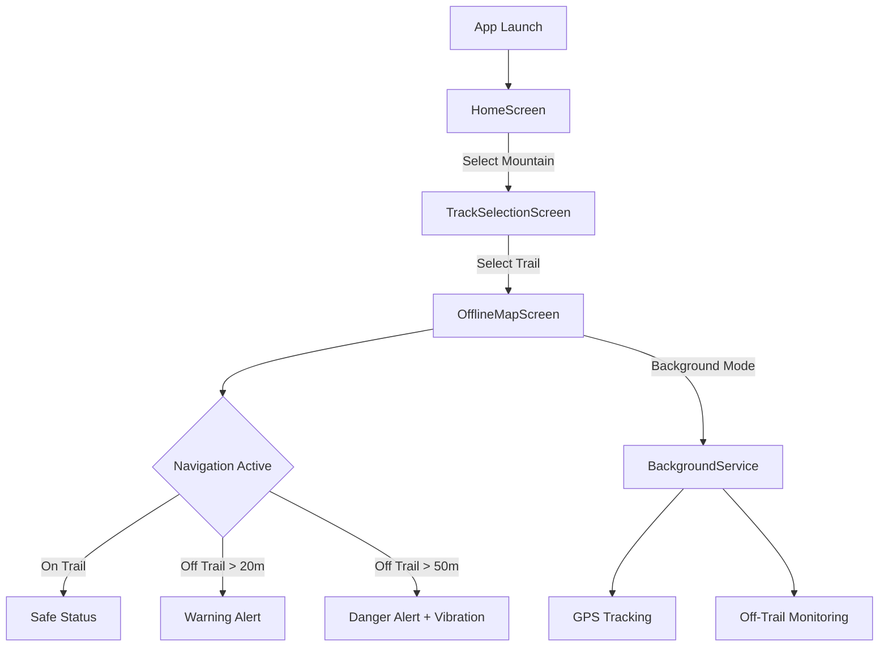
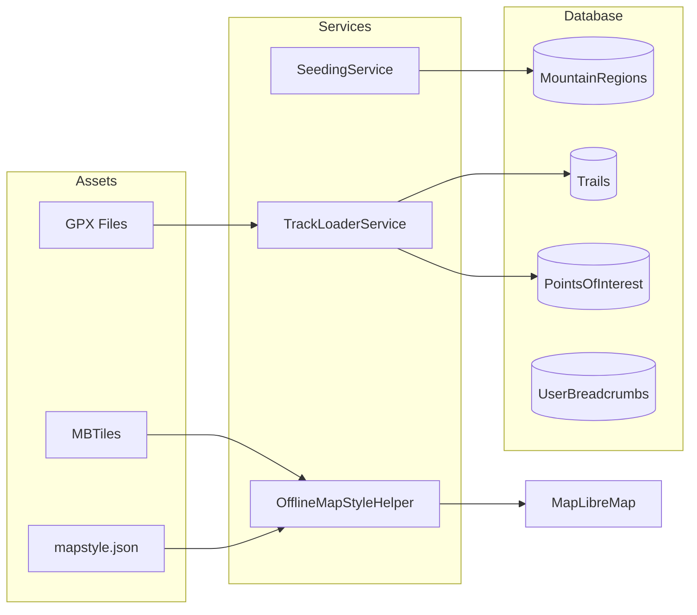

# PANDU Navigation App - Architecture & Workflow

## Overview
PANDU is an **offline-first** hiking navigation app for Indonesian mountains. It uses GPX tracks and vector MBTiles for 100% offline operation.

---

## User Flow



---

## Screen Architecture

### 1. HomeScreen (`/`)
**File:** [home_screen.dart](file:///c:/Users/Isfihanni/Documents/GNAV/lib/features/home/presentation/home_screen.dart)

| Component | Purpose |
|-----------|---------|
| MountainCard | Shows each mountain with offline status |
| allMountainsProvider | Streams mountains from database |

**User Action:** Tap mountain → Navigate to `/tracks`

---

### 2. TrackSelectionScreen (`/tracks`)
**File:** [track_selection_screen.dart](file:///c:/Users/Isfihanni/Documents/GNAV/lib/features/track_selection/presentation/track_selection_screen.dart)

| Component | Purpose |
|-----------|---------|
| TrackCard | Shows trail name, distance, elevation, difficulty |
| activeTrailsProvider | Fetches trails for selected mountain |
| basecampsProvider | Fetches basecamps (POIs of type basecamp) |

**User Action:** Tap "START" → Navigate to `/map`

---

### 3. OfflineMapScreen (`/map`)
**File:** [offline_map_screen.dart](file:///c:/Users/Isfihanni/Documents/GNAV/lib/features/navigation/presentation/offline_map_screen.dart)

| Component | Purpose |
|-----------|---------|
| MapLibreMap | Vector map with MBTiles |
| MapLayerService | Draws trails, markers, POIs |
| NavigationSheet | Shows compass, elevation, survival info |
| DeviationEngine | Calculates distance from trail |

---

## Data Pipeline



---

## Key Services

### TrackLoaderService
**File:** [track_loader_service.dart](file:///c:/Users/Isfihanni/Documents/GNAV/lib/core/services/track_loader_service.dart)

```dart
loadFullGpxData(assetPath, mountainId, trailId)
```

**Functions:**
- Parses GPX `<trk>` → [Trails](file:///c:/Users/Isfihanni/Documents/GNAV/lib/data/local/db/tables.dart#24-57) table (with spatial bounds)
- Parses GPX `<wpt>` → [PointsOfInterest](file:///c:/Users/Isfihanni/Documents/GNAV/lib/data/local/db/tables.dart#59-75) table
- **Smart Tagging:** Auto-categorizes waypoints (basecamp, summit, water, shelter)

---

### DeviationEngine
**File:** [deviation_engine.dart](file:///c:/Users/Isfihanni/Documents/GNAV/lib/features/navigation/logic/deviation_engine.dart)

```dart
calculateMinDistance(userLoc, trails) → double meters
determineStatus(distance) → SafetyStatus
```

**Thresholds:**
| Distance | Status |
|----------|--------|
| < 20m | `SafetyStatus.safe` |
| 20-50m | `SafetyStatus.warning` |
| > 50m | `SafetyStatus.danger` |

**Optimization:** Uses AABB (bounding box) for O(1) rejection of distant trails before expensive segment calculations.

---

### BackgroundService
**File:** [background_service.dart](file:///c:/Users/Isfihanni/Documents/GNAV/lib/core/services/background_service.dart)

**Runs when app is minimized:**
- GPS tracking every 5 seconds
- Kalman filter smoothing
- Off-trail deviation alerts
- Writes breadcrumbs to database

---

## File Structure

```
lib/
├── core/
│   ├── router.dart                    # go_router configuration
│   ├── theme/                         # App theme
│   ├── services/
│   │   ├── background_service.dart    # Background GPS tracking
│   │   ├── map_layer_service.dart     # MapLibre layer management
│   │   ├── seeding_service.dart       # Initial data seeding
│   │   └── track_loader_service.dart  # GPX parsing
│   └── utils/
│       ├── geo_math.dart              # Distance calculations
│       ├── kalman_filter.dart         # GPS smoothing
│       └── offline_map_style_helper.dart
│
├── data/
│   └── local/
│       └── db/
│           ├── app_database.dart      # Drift database
│           ├── tables.dart            # Table definitions
│           ├── converters.dart        # Type converters
│           └── daos/                  # Data access objects
│
├── features/
│   ├── home/
│   │   └── presentation/
│   │       ├── home_screen.dart       # Mountain list
│   │       └── widgets/
│   │           └── mountain_card.dart
│   │
│   ├── track_selection/
│   │   └── presentation/
│   │       ├── track_selection_screen.dart
│   │       └── widgets/
│   │           └── track_card.dart
│   │
│   └── navigation/
│       ├── logic/
│       │   ├── navigation_providers.dart  # Riverpod providers
│       │   ├── deviation_engine.dart
│       │   └── gps_state_machine.dart
│       └── presentation/
│           ├── offline_map_screen.dart    # Main map
│           └── widgets/
│               └── sheets/
│                   ├── navigation_sheet.dart
│                   └── search_overlay.dart

assets/
├── gpx/
│   └── merbabu/
│       ├── Selo.gpx
│       ├── Wekas.gpx
│       └── ...
├── map_data/
│   └── merbabu.mbtiles              # Vector tiles (user adds)
└── map_styles/
    └── mapstyle.json                 # OpenMapTiles vector style
```

---

## Database Schema

### MountainRegions
| Column | Type | Purpose |
|--------|------|---------|
| id | TEXT PK | e.g., `merbabu` |
| name | TEXT | Display name |
| localMapPath | TEXT? | Path to MBTiles |
| lat, lng | REAL | Center coordinates |
| isDownloaded | BOOL | Offline status |

### Trails
| Column | Type | Purpose |
|--------|------|---------|
| id | TEXT PK | e.g., `merbabu_selo` |
| mountainId | TEXT FK | Reference to mountain |
| geometryJson | TEXT | List of TrailPoint |
| minLat, maxLat, minLng, maxLng | REAL | Bounding box for fast queries |
| distance, elevationGain | REAL | Trail stats |
| summitIndex | INT | Index of highest point |

### PointsOfInterest
| Column | Type | Purpose |
|--------|------|---------|
| id | TEXT PK | Auto-generated |
| mountainId | TEXT FK | Reference to mountain |
| name | TEXT | POI name |
| type | INT | PoiType enum (basecamp, summit, water, shelter, dangerZone) |
| lat, lng, elevation | REAL | Coordinates |

---

## Offline-First Design

| Component | Offline Source |
|-----------|----------------|
| Map tiles | `.mbtiles` (vector) in `assets/map_data/` |
| Trail geometry | GPX → Database (seeded on first launch) |
| POI markers | GPX waypoints → Database |
| Style | `mapstyle.json` (bundled asset) |
| GPS | Device sensor (no network needed) |

> **No internet required** after initial app install. All data is bundled or pre-downloaded.

---

## Remaining Work

- [ ] OfflineMapScreen: Accept `mountainId` and `trailId` params
- [ ] OfflineMapScreen: Load MBTiles dynamically per mountain
- [ ] OfflineMapScreen: Draw selected trail on map load
- [ ] Add MBTiles files to `assets/map_data/`
