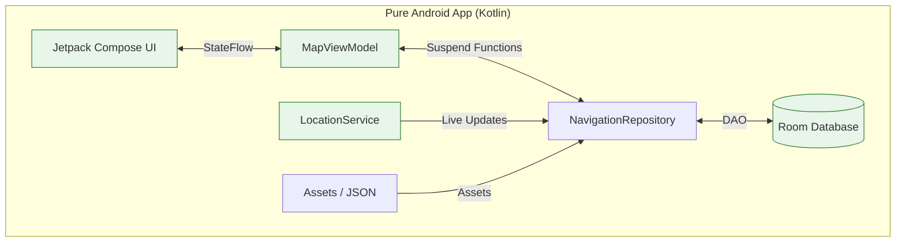

# The Ideal GNAV Architecture: A Unification Strategy

You asked for the absolute truth: "What would make this app easily working?"

The answer is to **STOP fighting two ecosystems.** The friction we experienced (Bridge crashes, Database path syncing, Type mismatches) implies we are using the wrong tool for this specific job.

## 🏆 The Recommendation: Pure Native (Kotlin + Jetpack Compose)

If I were to rebuild GNAV from scratch today to be "efficient" and "work easily," I would use **100% Kotlin** with **Jetpack Compose** for the UI.

### Why This Wins
1.  **One Language:** You write logic, UI, Database, and Services in **Kotlin**. No context switching between Dart and Java.
2.  **Zero Bridging:** There is no "Flutter Bridge." The UI talks directly to the Service. The Service talks directly to the Database. No serialization (`Gson`), no `MethodChannel`, no race conditions.
3.  **First-Class Backgrounding:** An offline hiking app lives or dies by its background service. Android native services are robust and documented. Flutter's background capabilities are a hacky wrapper around these native APIs anyway.
4.  **UI is Just as Fast:** Jetpack Compose is declarative (just like Flutter). Use `Column`, `Row`, `Text`—the concepts are identical.

## 🆚 Comparison

| Feature | Current Hybrid (Flutter + Native) | Ideal (Pure Kotlin) |
| :--- | :--- | :--- |
| **Language** | Dart (UI) + Java (Logic) | Kotlin (Everything) |
| **Database** | Drift (Dart) + Room (Java) **[Sync Pain]** | Room (Kotlin) **[Direct Access]** |
| **Communication** | Async Bridge (Fragile) | Direct Function Calls (Robust) |
| **Backgrounding** | Custom Java Service + Dart Bridge | Standard Android Service |
| **Map Rendering** | MapLibre Flutter Plugin | MapLibre Android SDK (Native) |
| **Complexity** | 🟥 High (2x Runtime) | 🟩 Low (1x Runtime) |

## 📐 The Blueprint (How it would look)

## 🚀 Migration Path (If we were to do it)
You don't need to throw away everything.
1.  **Logic:** The Java logic we wrote (`DeviationEngine`, `KalmanFilter`) is 90% compatible with Kotlin (Kotlin interops with Java perfectly).
2.  **Assets:** `mountains.json` and GPX files remain exactly the same.
3.  **UI:** You would rewrite the Flutter Widgets into Compose Composables (Standard `Box`, `Column`, `Text` translation).

## 💡 The "Why"
We struggled because we tried to make Flutter (a UI toolkit) do OS-level heavy lifting (Hardware GPS, Background Threads, File I/O). Flutter is great for apps that *fetch data*. It is painful for apps that *process hardware data in the background*.

**Verdict:** Go Pure Native. It aligns correctly with the "Hardware-first" nature of a hiking survival tool.
