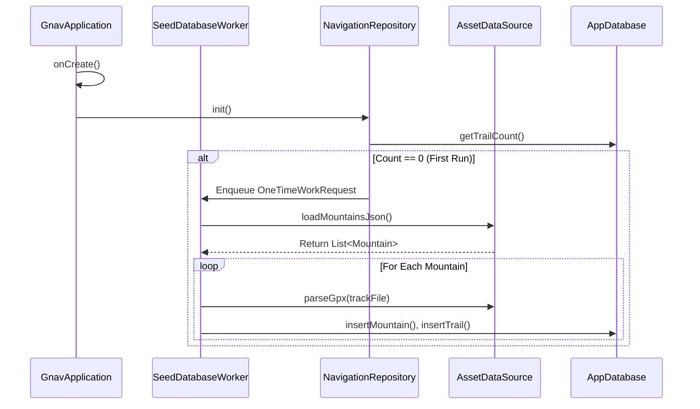
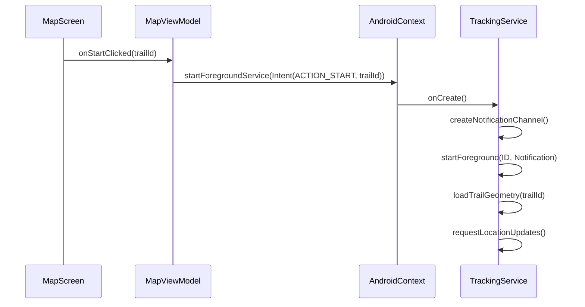
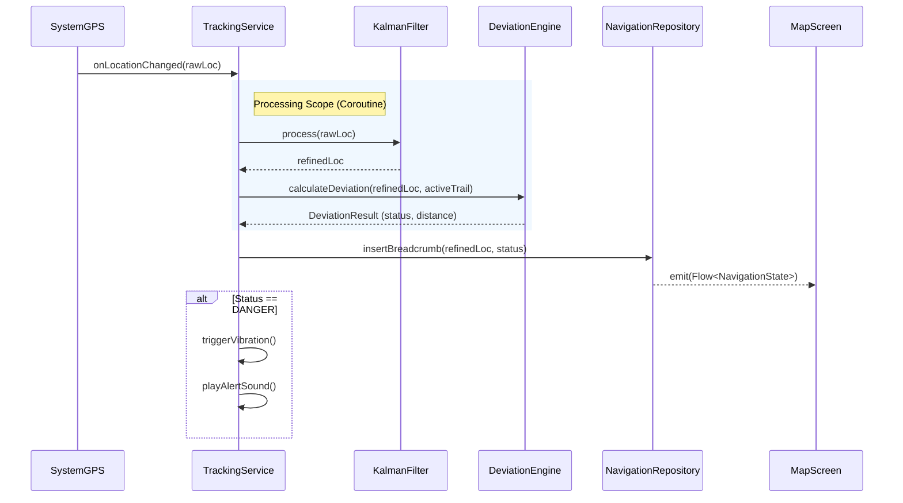

# GNAV Reborn: Runtime Flow & Function Logic

This document details **exactly how the code flows** in the proposed Pure Kotlin architecture. It moves beyond high-level boxes to actionable function signatures and sequence diagrams.

## 1. The "Cold Start" Flow (Data Seeding)
**Goal:** Ensure the database (`Room`) has data before the UI loads.



### Key Functions
**`AssetDataSource.kt`**
```kotlin
// Parses JSON/GPX using Kotlin Serialization (Fast & Null-safe)
suspend fun loadMountains(): Result<List<Mountain>>
suspend fun parseGpxSegments(inputStream: InputStream): List<List<Coord>>
```

**`NavigationRepository.kt`**
```kotlin
// Called by ViewModel to confirm data exists
val isSeeded: StateFlow<Boolean>
```

---

## 2. The "Navigation Start" Flow
**Goal:** User clicks "Start Hike" -> Service spins up -> Tracking begins.



### Key Functions
**`MapViewModel.kt`**
```kotlin
fun startNavigation(trailId: String) {
    val intent = Intent(context, TrackingService::class.java).apply {
        action = ACTION_START_TRACKING
        putExtra(EXTRA_TRAIL_ID, trailId)
    }
    context.startForegroundService(intent)
}
```

**`TrackingService.kt`**
```kotlin
override fun onStartCommand(intent: Intent?, flags: Int, startId: Int): Int {
    when(intent?.action) {
        ACTION_START_TRACKING -> {
            val trailId = intent.getStringExtra(EXTRA_TRAIL_ID)
            initializeTracking(trailId)
        }
        ACTION_STOP_TRACKING -> stopSelf()
    }
    return START_STICKY
}
```

---

## 3. The "Heartbeat" (Real-Time Loop)
**Goal:** Iterate 1x per second: GPS -> Filter -> Logic -> DB -> UI.



### Key Functions
**`DeviationEngine.kt`**
```kotlin
// Pure math function, testable in isolation
fun calculateDeviation(
    current: Coord, 
    path: List<Coord>, 
    thresholdMeters: Double
): DeviationResult {
    // 1. Find nearest point on polyline (Cross-Track Distance)
    val (nearestPoint, distance) = GeoMath.nearestPointOnLine(current, path)
    
    // 2. Return State
    return if (distance > thresholdMeters) {
        DeviationResult.OffTrail(distance)
    } else {
        DeviationResult.OnTrail
    }
}
```

**`NavigationRepository.kt`**
```kotlin
// The Single Source of Truth for the UI
// Room Observables automatically emit when inserts happen
fun observeCurrentSession(): Flow<NavigationState> {
    return appDatabase.breadcrumbDao().getLastBreadcrumbFlow()
        .combine(deviationFlow) { crumb, deviation ->
            NavigationState(
                lat = crumb.lat,
                lng = crumb.lng,
                isOffTrail = deviation is OffTrail,
                distanceToPath = deviation.distance
            )
        }
}
```

## Summary of Efficiency
1.  **State Unification:** The UI *never* polls for data. It simply collects a `Flow` from the Room Database/Repository. When the Service writes a new point, the UI updates automatically.
2.  **Logic Isolation:** Code like `calculateDeviation` is pure Kotlin logic. It doesn't know about Android, Services, or Databases. This makes it instant to unit test.
3.  **Concurrency:** Heavy math runs on `Dispatchers.Default` (Background threads) via Coroutines, ensuring the UI (Main Thread) never jitters.
